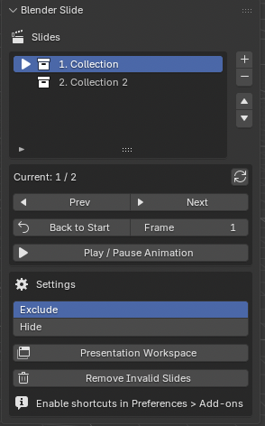

# Blender Slide

Blender Slide is a Blender add-on that allows collections to be used as presentation slides.

## Features

- Collection based slides
- Next / Previous navigation
- EXCLUDE mode
- HIDE mode
- Presentation workspace
- Optional shortcuts

## Installation

Requires Blender 4.2 or later.

1. Download `blender_slide.py` from the latest release.
2. Open Blender.
3. Go to `Edit > Preferences > Add-ons`.
4. Click `Install from Disk`.
5. Select `blender_slide.py`.
6. Enable `Blender Slide`.
## Blender Version

4.2+
## Usage

1. Create collections for each slide.
2. Select a collection in Blender.
3. Click the `+` button in the Blender Slide panel to add it as a slide.
4. Use `Prev` / `Next` to switch slides.
5. Use `Presentation Workspace` to create a workspace for presenting.

## Switch Methods

### Exclude

Excludes non-current slide collections from the view layer.  
This is lightweight and also affects rendering.

### Hide

Hides non-current slide collections in the viewport only.  
This does not affect rendering.

## Shortcuts

Shortcuts are disabled by default.

To enable them:

1. Open `Edit > Preferences > Add-ons`.
2. Find `Blender Slide`.
3. Enable `Register shortcuts (PageUp / PageDown)`.

Default shortcuts:

- `PageUp`: Previous slide
- `PageDown`: Next slide

You can change them in `Preferences > Keymap` by searching for:

- `blender_slide.prev`
- `blender_slide.next`

## License

This project is licensed under the GNU General Public License v3.0.
